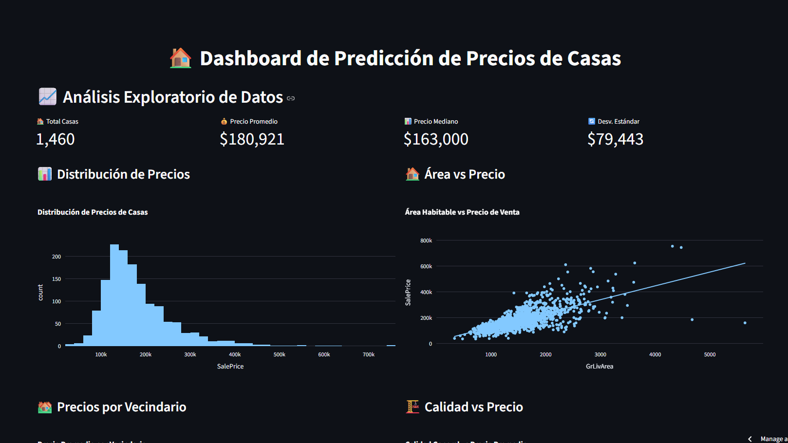

# prediccion-casas

Este es un proyecto de ciencia de datos que utiliza técnicas de aprendizaje automático para predecir los precios de las casas en función de diversas características.
Haciendo uso del conjunto de datos de viviendas de Kaggle, este proyecto incluye análisis exploratorio de datos, visualización y construcción de modelos predictivos.
Y entrega visualizaciones y análisis detallados para comprender mejor los factores que afectan los precios de las viviendas.

https://prediccion-casas.streamlit.app/ 

## Características

- Predicción de precios de casas
- Análisis de datos
- Visualización de datos
- Modelos de aprendizaje automático

## Tecnologías

- Python
- Pandas
- Scikit-learn
- Matplotlib
- Jupyter Notebook

